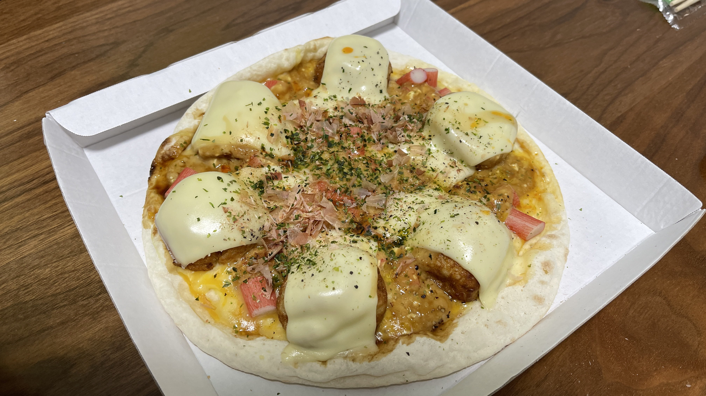

# 3種のシーフードピザ
タコとカニとウニの風味がつまった美味しい、多分美味しいピザです。二度と作りません。

## 材料(1枚分)
| 材料名 | 分量 | カロリー(kcal) |
| :-- | :-- | :-- |
| チーズピザ        | 1枚 | 399 |
| とろけるチーズ     | 3枚 | 159 |
| たこ焼き(6個入り) | 1パック | 240 |
| カニカマ         | 好きなだけ | 90 |
| プリン           | １個 | 145 |
| 醤油             | 少々 | |
| たこ焼きソース     | 少々 | |
| マヨネーズ        | 少々 | |
| 鰹節             | 適量 | |
| アオサ粉          | 適量 | |
| コショウ          | 少々 | |
| オリーブオイル     | 適量 | |

## 手順
1. たこ焼きをレンジで温める。
2. カニカマを刻む。
3. プリンを振ってトロトロにする。
4. 3の液状になったプリンに醤油、たこ焼きソース、マヨネーズを入れてよく混ぜる。
5. ピザに4で作ったソースを塗り、たこ焼き、刻みカニカマを置いて500W2分30秒で温める。
6. 鰹節、アオサ粉をかけて出来上がり。

## 評価
夏野「」

鍋箸「」

BBD「たこ焼きでうまくまとまった風を醸し出してるけど、美味しくない。」
