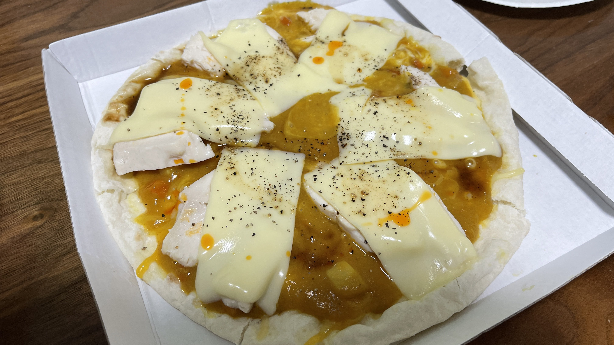

# 自炊3日目ピザ
「よっしゃこれから飯自分で作るで！」

米米米米(こめこめ まいべい)はそう意気込んだ。

これはその3日後、あまりの面倒くささに彼が作った、手が込んでいるのかいないのかよくわからないピザのレシピだ。

１年後彼は麦麦麦麦(ばくばく むぎむぎ)になったのは別のお話。

## 材料(1枚分)
| 材料名 | 分量 | カロリー(kcal) |
| :-- | :-- | :-- |
| チーズピザ        | 1枚 | 399 |
| とろけるチーズ     | 3枚 | 159 |
| サラダチキン | 1塊 | 125 |
| すみっこぐらしカレー | １袋　| 139 |
| ラー油 | 適量 |  |
| コショウ | 少々 | |

## 手順
1. ピザに**すみっこぐらしカレ**ーを均等に塗る。
2. サラダチキンをスライスして、ピザに並べる。
3. サラダチキンを覆うようにチーズを並べる。
4. コショウとラー油をかけて、500W2分30秒温めたら出来上がり。

## 評価
夏野「」

鍋箸「」

BBD「サラダチキンでチャラになると思ってた、ならん。」
