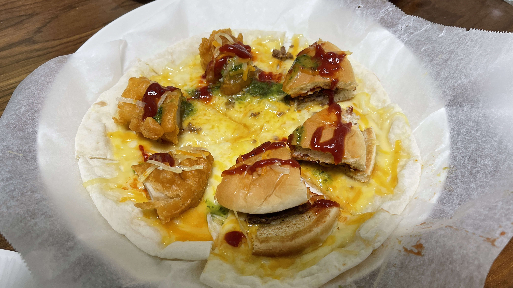

# 最強のハーフアンドハーフ
男と生まれたからには、誰でも一生の内一度は夢見る「地上最強のピザ」―。
グラップラーとは、「地上最強のピザ」を目指す飽くなき探求心を持つ大学生のことである！

## 材料(1枚分)
| 材料 | 分量 | カロリー(kcal) |
| :-- | :-- | :-- |
| 伊藤ハム ピザガーデン 濃厚チーズピザ | 1枚 | 399 |
| マクドナルド 倍ハンバーガー | 1/2個 | 178 |
| ケンタッキーフライドチキン カーネルクリスピー | 1個 | 130 |
| カゴメ トマトケチャップ | 少々 | |
| キューピー Italiante バジルソース | 少々 |
| マキルヘニー タバスコ ペッパーソース | 少々 |

## 手順
1. ピザを皿に移し替え、あらかじめ n 等分しておく。(nは任意の自然数)
2. 倍ハンバーガーを n/2 等分し、ピザの半面に乗せる。
3. カーネルクリスピーを n/2 等分し、ピザの半面に乗せる。
4. レンジで 500W 2分30秒 程度加熱する。
5. ケチャップ、バジルソース、タバスコを全体に振りかける。
6. レンジで 500W 20秒 程度加熱する。
7. 完成。お好みで追いタバスコなどどうぞ。