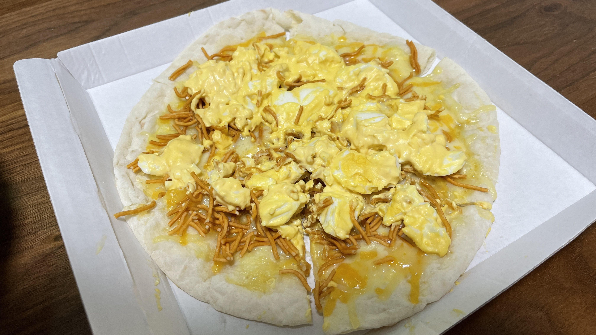

# カンブリア紀黎明期の地層から発見された利便性追求情報書類"CPD"(Convenience Pursuit Document)に記された理論をもとに生成されたピザ通称ベビースターエッグチーズピザ

## 材料(1枚分)
| 材料 | 分量 | カロリー(kcal) |
| :-- | :-- | :-- |
| 伊藤ハム ピザガーデン 濃厚チーズピザ | 1枚 | 399 |
| ベビースターラーメン ビッグ（チキン味） | 1/2袋 | 169 |
| キューピー つぶしてつくろう たまごサラダ | 1袋 | 310 |

## 手順
1. ピザを皿に移し替え、あらかじめ n 等分しておく。(nは任意の自然数)。
2. 全体にまんべんなくベビースターをふりかける。
3. お好みの粗さでつぶした卵サラダを全体に載せる。
4. レンジで 500W 3分 程度加熱する。
5. お好みであらびきコショウをかけてもGood！