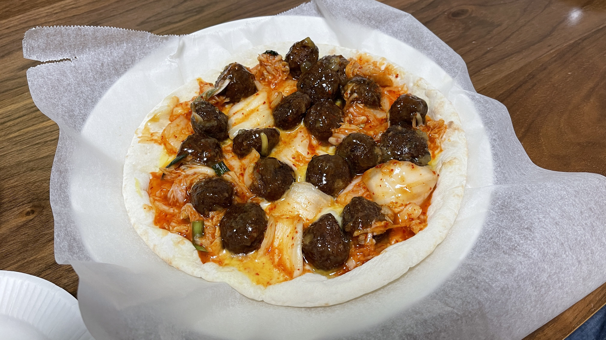

# 中華風ピザ

## 材料(1枚分)

| 材料 | 分量 | カロリー(kcal) |
| :-- | :-- | :-- |
| ピザ生地 | 1枚 | 399 |
| 肉団子 | 2袋 | 562 |
| キムチ | 100g | 53 |

* [ピザ生地] ピザガーデン 濃厚チーズピザ (399kcal) [伊藤ハム](
https://www.itoham.co.jp/product/product/detail.html?pdid=509)

* [肉団子] 炸肉丸子 2袋 (281kcal × 2) [日本ハム](
https://www.nipponham.co.jp/products/processed_foods/meatball/2198/)

* [キムチ] ご飯がススムキムチ 100g (53kcal/100g) [ピックルス](
https://www.pickles.co.jp/products/susumu/s-kimchi/)

## 作り方
1. 皿にクッキングシートを広げピザ生地を設置します
2. キムチを広げます
3. 炸肉丸子を配置します
4. 電子レンジでチンします(500Wで3分半)
5. 完成

